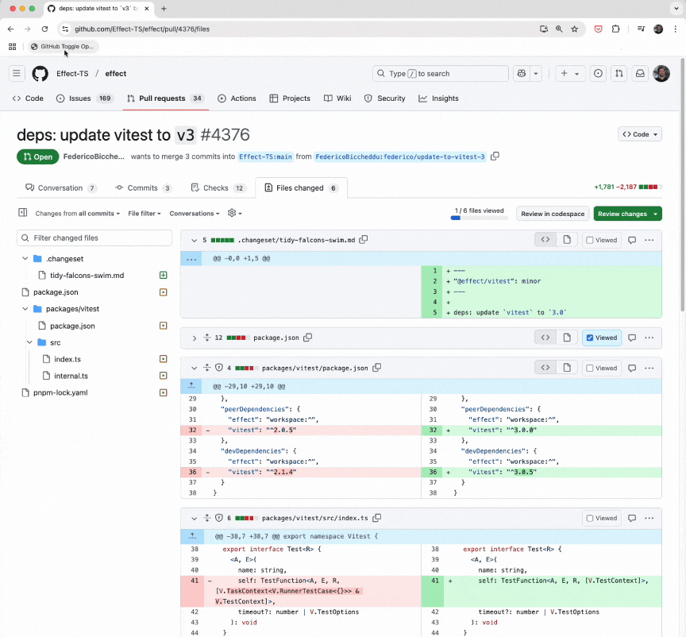

# Toggle opened/collapsed files in GitHub files changes PR view

Bookmarklet that

- collapses files that are currently opened
- opens files that are currently collapsed



## Put inside your bookmarks

```js
javascript:[...document.querySelectorAll('[aria-label="Toggle diff contents"]')].forEach(_ => _.click())())
```
